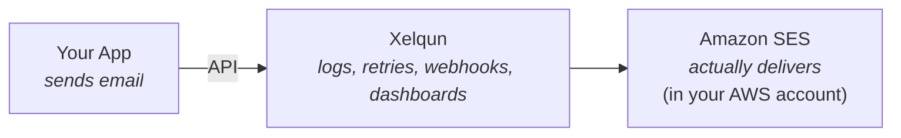
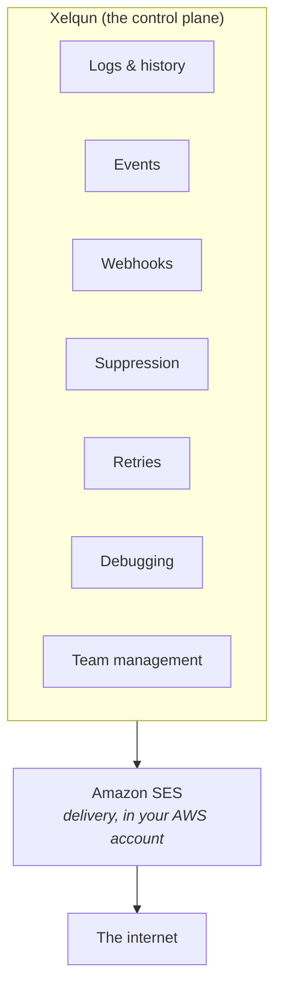

# Xelqun

**An open-source email operations platform for Amazon SES. It adds the dashboards, logs, retries, webhooks, suppression management, and team tools that SES doesn't give you, while your email keeps running inside your own AWS account.**

> ⚠️ **Status: Under active development. Not usable yet.**
> Xelqun is being built in the open and is not production-ready. The features below are planned or in progress. There is no stable release, so don't rely on it for anything real yet.

---

## What is Xelqun?

Xelqun is a self-hosted email operations platform that sits on top of Amazon SES. It does not replace SES or become another email provider. It gives you the operational tooling that SES leaves out.

> **The open-source control plane for Amazon SES.**

Xelqun focuses on email operations, not email delivery. It is built for Amazon SES only right now. The internals keep a provider-agnostic foundation so more providers can be added later, but SES is the whole focus today.

## Why Xelqun?

Connect your AWS account and get a working email platform right away: dashboards, logs, retries, bounce and complaint handling, suppression lists, and team management. It all runs on your own infrastructure, so you don't have to build any of it yourself.

### Why not just point my app at SES directly?

For basic sending, you should. If all you need is `App -> SES`, Xelqun adds nothing. SES already gives you SMTP and an API, and most frameworks already have a mailer that talks to it. Xelqun is not an easier way to send email.

The value shows up once email becomes something you have to operate, not just call. When you're sending real volume, SES leaves these gaps for you to fill:

- **Where did my email go?** You want a searchable history of every message and its status (queued, sent, accepted, delivered), not a send call that returns nothing.
- **Why didn't the customer receive it?** SES reports bounces, complaints, and deliveries, but only if you build the pipeline yourself: SNS, a webhook endpoint, a queue, a database, and a dashboard. Xelqun is that pipeline.
- **Suppression management.** A permanent bounce should stop you from ever emailing that address again. You don't want to rebuild this in every app.
- **Debugging.** When someone asks why John didn't get his password reset, you want one timeline (app accepted, queued, SES accepted, delivered) instead of digging through CloudWatch, app logs, SES, and SNS.

So Xelqun isn't a nicer way to use SES. It's the operations layer around email delivery.

SES delivers the email. Xelqun runs the operations around it. If you're running a SaaS and email has become infrastructure you operate rather than a function you call, Xelqun is for you.

## Who it's for

- Developers and engineering teams
- SaaS founders
- Agencies
- Companies already using AWS
- Teams wanting full control over their email infrastructure
- Organizations that prefer self-hosting or have compliance requirements

## Planned MVP features

> Xelqun supports Amazon SES only. Other providers are out of scope until the SES experience is solid.

**Email Sending**
- Transactional Email API
- Email templates
- SMTP support (optional, later)

**Operations**
- Email logs & searchable history
- Retry queues
- Failed email management
- Scheduled emails

**Deliverability**
- Bounce handling
- Complaint handling
- Suppression lists
- Webhook processing

**Management**
- API keys
- Domain verification
- Multi-project support
- Team management

**Infrastructure**
- Docker deployment
- Self-hosted
- Open source

## Not included in V1

- Marketing campaigns
- Contact management
- Audience segmentation
- Newsletters
- Marketing automation
- Drag-and-drop builders
- AI features

## Roadmap

### V1: MVP (in progress) — the whole focus right now
Everything you need to operate Amazon SES in production. This is where all effort goes today; the later versions are only a direction, not active work.

- [x] Amazon SES support
- [x] Transactional email API
- [ ] Email templates
- [ ] Email logs & searchable history _(logs and event timeline done, search/filter pending)_
- [ ] Retry queues & failed email management _(queued sending done, failed-email management/resend pending)_
- [ ] Scheduled emails
- [x] Bounce & complaint handling
- [x] Suppression lists
- [x] Webhook processing
- [x] API keys
- [x] Domain verification
- [x] Multi-project support _(via teams)_
- [x] Team management
- [ ] Docker deployment

### V2: More providers (later, not started)
Once SES is solid, make Xelqun provider-agnostic in practice, not just in architecture.

- [ ] Postmark
- [ ] Resend
- [ ] Mailgun
- [ ] SendGrid
- [ ] Unified provider abstraction
- [ ] Event normalization across providers

### V3: Advanced
Resilience, insight, and optionally marketing email.

- [ ] Provider failover
- [ ] Multi-provider routing
- [ ] Unified analytics
- [ ] Marketing email
- [ ] Contact management
- [ ] Audience segmentation

## Technical principles

- Provider-agnostic architecture
- Event normalization across providers
- Queue-first architecture
- Docker-first deployment
- API-first
- Open-source core

## Tech stack

- **Backend:** Laravel 13, PHP 8.3+
- **Database:** PostgreSQL
- **Frontend:** Inertia v3, Vue 3 (TypeScript), Tailwind CSS v4
- **Auth:** Laravel Fortify (login, registration, email verification, 2FA/TOTP, recovery codes)
- **Deployment:** Docker, self-hosted

## Getting started

Installation and setup instructions are coming soon, once the MVP stabilizes.

## License

Xelqun is open source under the [GNU Affero General Public License v3.0](LICENSE) (AGPL-3.0).
