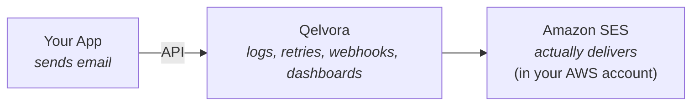

# Qelvora

**An open-source email operations platform that transforms Amazon SES into a production-ready email service — with dashboards, logs, retries, webhooks, suppression management, analytics, and team collaboration — while keeping your email infrastructure entirely under your own AWS account.**

> ⚠️ **Status: Under active development — not usable yet.**
> Qelvora is being built in the open and is **not production-ready**. Features listed below are planned or in progress. There is no stable release, and you should not rely on it for anything real at this time.

---

## What is Qelvora?

Qelvora is a self-hosted **email operations platform** that sits on top of your own email provider. It does **not** replace Amazon SES or become another email provider — instead, it provides the operational tooling that SES lacks.

> **The open-source control plane for Amazon SES.**
> The easiest way to operate Amazon SES in production.

Qelvora focuses on **email operations**, not email delivery. The architecture is provider-agnostic from day one, but the MVP targets **Amazon SES only**.

## Why Qelvora?

Instead of building all the operational tooling yourself, connect your AWS account and instantly get a production-ready email platform — dashboards, logs, retries, bounce/complaint handling, suppression lists, and team management, all running on **your own infrastructure**.

## Who it's for

- Laravel developers
- SaaS founders
- Agencies
- Companies already using AWS
- Teams wanting full control over their email infrastructure
- Organizations that prefer self-hosting or have compliance requirements

## Planned MVP features

> MVP supports **Amazon SES only**. Additional providers arrive in later versions.

**Email Sending**
- Transactional Email API
- Email templates
- SMTP support (optional, later)

**Operations**
- Email logs & searchable history
- Retry queues
- Failed email management
- Scheduled emails

**Deliverability**
- Bounce handling
- Complaint handling
- Suppression lists
- Webhook processing

**Management**
- API keys
- Domain verification
- Multi-project support
- Team management

**Infrastructure**
- Docker deployment
- Self-hosted
- Open source

## Not included in V1

- Marketing campaigns
- Contact management
- Audience segmentation
- Newsletters
- Marketing automation
- Drag-and-drop builders
- AI features

## Roadmap

### V1 — MVP (in progress)
Everything you need to operate Amazon SES in production.

- [ ] Amazon SES support
- [ ] Transactional email API
- [ ] Email templates
- [ ] Email logs & searchable history
- [ ] Retry queues & failed email management
- [ ] Scheduled emails
- [ ] Bounce & complaint handling
- [ ] Suppression lists
- [ ] Webhook processing
- [ ] API keys
- [ ] Domain verification
- [ ] Multi-project support
- [ ] Team management
- [ ] Docker deployment

### V2 — More providers
Make Qelvora provider-agnostic in practice, not just in architecture.

- [ ] Postmark
- [ ] Resend
- [ ] Mailgun
- [ ] SendGrid
- [ ] Unified provider abstraction
- [ ] Event normalization across providers

### V3 — Advanced
Resilience, insight, and (optionally) marketing email.

- [ ] Provider failover
- [ ] Multi-provider routing
- [ ] Unified analytics
- [ ] Marketing email
- [ ] Contact management
- [ ] Audience segmentation

## Technical principles

- Provider-agnostic architecture
- Event normalization across providers
- Queue-first architecture
- Docker-first deployment
- API-first
- Open-source core

## Tech stack

- **Backend:** Laravel 13, PHP 8.3+
- **Frontend:** Inertia v3, Vue 3 (TypeScript), Tailwind CSS v4
- **Auth:** Laravel Fortify (login, registration, email verification, 2FA/TOTP, recovery codes)
- **Deployment:** Docker, self-hosted

## Getting started

Installation and setup instructions are **coming soon** once the MVP stabilizes.

## License

Qelvora is open source under the [GNU Affero General Public License v3.0](LICENSE) (AGPL-3.0).
